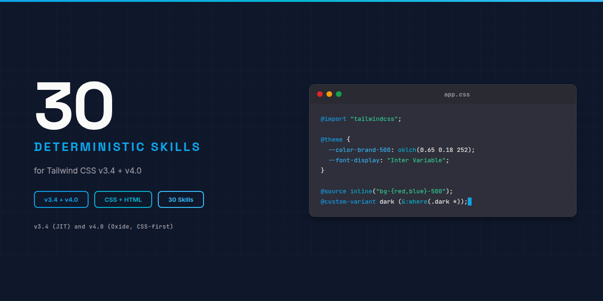

# Tailwind CSS : Claude Skill Package

<p align="center">
  
</p>


**30 deterministic Claude AI skills for Tailwind CSS v3.4 and v4.0+ : utility classes, config (JS + CSS-first), variants, plugins, JIT engine, build integration, dark mode, migration, and the tailwind-merge interop pattern for shadcn/ui.**

Built on the [Agent Skills](https://agentskills.org) open standard. Discoverable via npm-agentskills manifest and OpenAI Codex skill discovery.

## Why This Exists

Without skills, Claude lacks deterministic guidance for Tailwind CSS. Common failure modes:

```tsx
// Wrong : template literal class name disappears in production build
const Tag = ({ color }: { color: string }) => (
  <span className={`bg-${color}-500`}>Tag</span>
);
```

```css
/* Wrong : @apply inside Vue scoped style fails with "Cannot apply unknown utility class" */
<style scoped>
  .btn { @apply px-4 py-2 bg-blue-500; }
</style>
```

With this skill package, Claude produces correct patterns:

```tsx
// Right : static map, scanner picks it up at build time
const COLOR_BG = { red: "bg-red-500", blue: "bg-blue-500" } as const;
const Tag = ({ color }: { color: keyof typeof COLOR_BG }) => (
  <span className={COLOR_BG[color]}>Tag</span>
);
```

```css
/* Right : @reference imports the theme into the scoped block (v4) */
<style scoped>
  @reference "../app.css";
  .btn { @apply px-4 py-2 bg-blue-500; }
</style>
```

## What's Inside

| Category | Count | Purpose |
|----------|:-----:|---------|
| **core/** | 3 | Architecture, design system, v3-vs-v4 model |
| **syntax/** | 10 | Utility classes, variants, responsive, dark mode, arbitrary values, v4-only features |
| **impl/** | 11 | Configuration (v3/v4), build integrations, plugins, @apply, tailwind-merge, migration |
| **errors/** | 5 | Utility-soup, build failures, dynamic classes, v4 migration traps, specificity |
| **agents/** | 1 | Cross-skill validator |
| **Total** | **30** | |

See [INDEX.md](INDEX.md) for the complete skill catalog with descriptions and dependency graph.

## Installation

### Claude Code (recommended)

```bash
# Clone the full package
git clone https://github.com/OpenAEC-Foundation/TailwindCSS-Claude-Skill-Package.git
cp -r TailwindCSS-Claude-Skill-Package/skills/source/ ~/.claude/skills/tailwind/
```

### As git submodule

```bash
git submodule add https://github.com/OpenAEC-Foundation/TailwindCSS-Claude-Skill-Package.git .claude/skills/tailwind
```

### Via npm-agentskills standard

```bash
npx skills add @openaec/tailwindcss-claude-skill-package
```

### Claude.ai (web)

Upload individual SKILL.md files as project knowledge.

## Skill Structure

Every skill follows 3-level progressive disclosure:

```
tailwind-{category}-{topic}/
SKILL.md                  Main guidance (< 500 lines)
references/
    methods.md            Complete API signatures
    examples.md           Working code examples
    anti-patterns.md      What NOT to do (with explanations)
```

YAML frontmatter uses folded scalar `>`, "Use when..." opener, and a `Keywords:` line mixing technical + symptom-based + plain-language terms for maximum discoverability across Claude's skill-matching pipeline.

## Quality Guarantees

- **Deterministic language** : ALWAYS / NEVER, no "you might consider"
- **Dual v3 + v4 coverage** : every skill where versions diverge ships explicit v3 and v4 columns (Decision D-008)
- **WebFetch-verified** : every code-snippet validated against official Tailwind docs (30 sources verified per SOURCES.md)
- **CI/CD validated** : frontmatter, line count, structure, language, em-dash checks on every push
- **Compliance audit** : 100% score, 4/4 validation checks passing (see [docs/validation/audit-report.md](docs/validation/audit-report.md))

## Companion Skill Packages

| Package | Bridge skill | Skills | Repo |
|---------|--------------|--------|------|
| shadcn/ui | `tailwind-impl-tailwind-merge` | TBD | [Link](https://github.com/OpenAEC-Foundation/shadcn-ui-Claude-Skill-Package) |
| Frontend Design | `tailwind-core-design-system` | 18 | [Link](https://github.com/OpenAEC-Foundation/Frontend-Design-Claude-Skill-Package) |
| Vite | `tailwind-impl-build-vite` | 22 | [Link](https://github.com/OpenAEC-Foundation/Vite-Claude-Skill-Package) |

## Related Skill Packages (OpenAEC Foundation)

| Package | Skills | Repo |
|---------|--------|------|
| Blender-Bonsai-ifcOpenshell-Sverchok | 73 | [Link](https://github.com/OpenAEC-Foundation/Blender-Bonsai-ifcOpenshell-Sverchok-Claude-Skill-Package) |
| Frappe | 61 | [Link](https://github.com/OpenAEC-Foundation/Frappe_Claude_Skill_Package) |
| Speckle | 25 | [Link](https://github.com/OpenAEC-Foundation/Speckle-Claude-Skill-Package) |
| Tauri 2 | 27 | [Link](https://github.com/OpenAEC-Foundation/Tauri-2-Claude-Skill-Package) |

See full list at [OpenAEC-Foundation](https://github.com/OpenAEC-Foundation).

## License

MIT : OpenAEC Foundation

## Contributing

See [CONTRIBUTING.md](CONTRIBUTING.md). Built with the [Skill Package Workflow Template](https://github.com/OpenAEC-Foundation/Skill-Package-Workflow-Template) methodology.
